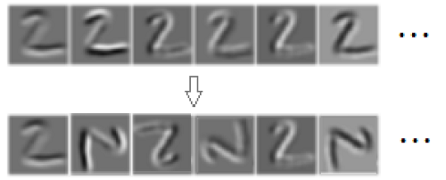

## Rotation-Feature

Rotating feature map for 4 directions--0, 90, 180, 270 degrees in order by CUDA.

#### Install for PyTorch

install Rotation-Feature:

> sh install.sh

#### Just using the rotation function

You can modify the 'rotationFeatureKernel.cu' to implement the rotation matrix on GPU for your need in the path of 'rotation_feature/src'.

## Acknowledgement

This work is partially based on the code of [Gabor Convolutional Networks](https://github.com/bczhangbczhang/Gabor-Convolutional-Networks).